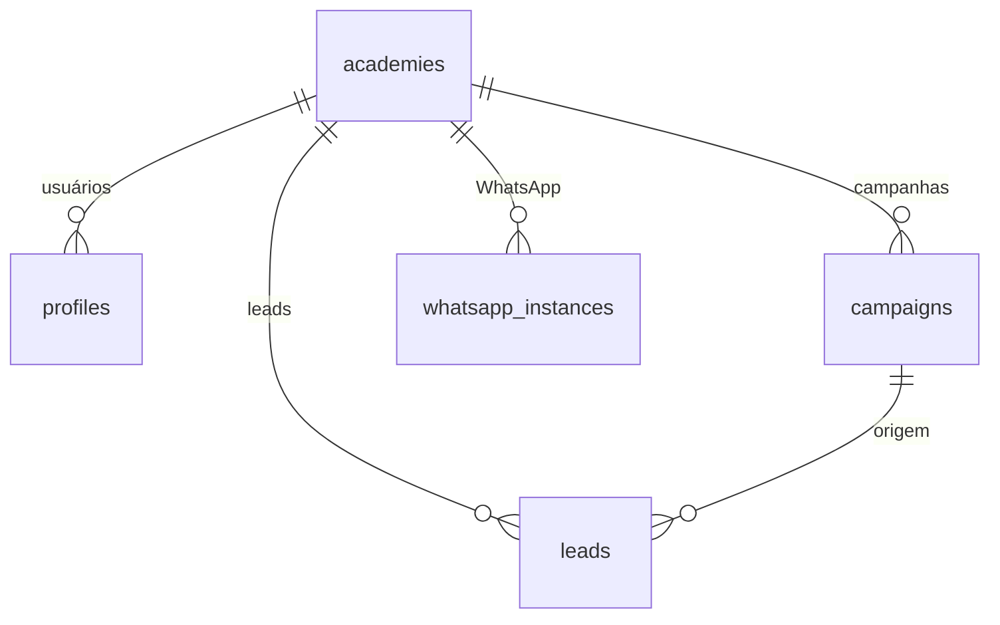

# GapSelling — Database Schema

Documentação do schema de banco de dados derivada de `Docs/Database/Schema.csv`.

Plataforma **multi-tenant**: cada academia (`academies`) é um tenant isolado. A maioria das entidades operacionais possui `academy_id` como chave de isolamento lógico.

---

## Visão geral da arquitetura



| Papel | Tabela | Escopo |
|-------|--------|--------|
| Tenant (raiz) | `academies` | Global — identifica cada academia |
| Usuários | `profiles` | Por academia (`academy_id`) |
| Comercial | `leads` | Por academia (`academy_id`) |
| Automação | `campaigns` | Por academia (`academy_id`) |
| Integração | `whatsapp_instances` | Por academia (`academy_id`) |

---

## `academies`

**Função:** Entidade raiz do multi-tenant. Representa cada academia (tenant) da plataforma — identidade, contato e metadados institucionais.

| Coluna | Tipo | Descrição |
|--------|------|-----------|
| `id` | uuid | Identificador único do tenant |
| `name` | text | Nome da academia |
| `slug` | text | Identificador legível para URLs/rotas |
| `logo_url` | text | URL do logotipo |
| `website` | text | Site da academia |
| `phone` | text | Telefone principal |
| `address` | text | Endereço |
| `created_at` | timestamp | Data de criação |

**Multi-tenant:** Tabela de referência. Todas as demais entidades de negócio devem vincular-se a `academies.id` para garantir isolamento entre academias.

---

## `profiles`

**Função:** Perfil de usuário vinculado ao Supabase Auth (`user_id`). Associa cada login a uma academia e armazena dados básicos de identificação do operador.

| Coluna | Tipo | Descrição |
|--------|------|-----------|
| `id` | uuid | Identificador do perfil |
| `user_id` | uuid | Referência ao usuário Supabase Auth |
| `login_name` | text | Nome de exibição do usuário |
| `email` | text | E-mail |
| `gym_name` | text | **Legado** — nullable; usar `academies.name` |
| `address` | text | Endereço (cópia ou complemento) |
| `phone` | text | Telefone do usuário |
| `created_at` | timestamptz | Data de criação |
| `academy_id` | uuid | FK → `academies.id` — tenant do usuário |

**Multi-tenant:** `academy_id` define a qual academia o usuário pertence. Políticas RLS devem restringir leitura/escrita ao tenant do usuário autenticado.

---

## `leads`

**Função:** Central de leads — contatos comerciais captados ou importados por academia. Suporta status, estágio de pipeline (CRM), origem, tags e vínculo com campanha.

| Coluna | Tipo | Descrição |
|--------|------|-----------|
| `id` | uuid | Identificador do lead |
| `academy_id` | uuid | FK → `academies.id` |
| `name` | text | Nome do lead |
| `phone` | text | Telefone (canal principal WhatsApp) |
| `email` | text | E-mail |
| `status` | text | Status operacional (ex.: ativo, inativo) |
| `stage` | text | Etapa do CRM (ex.: Novo Lead, Conversando, Fechado) |
| `source` | text | Origem do lead (manual, importação, campanha) |
| `created_at` | timestamp | Data de cadastro |
| `campaign_id` | uuid | FK → `campaigns.id` — campanha associada |
| `tag` | text | Tag de segmentação |

**Multi-tenant:** Isolado por `academy_id`. Leads de uma academia não devem ser visíveis a outras.

---

## `campaigns`

**Função:** Campanhas de automação comercial por academia. Define segmentação (`tag`), prompt de IA e estado de ativação para disparo via n8n/WhatsApp.

| Coluna | Tipo | Descrição |
|--------|------|-----------|
| `id` | uuid | Identificador da campanha |
| `academy_id` | uuid | FK → `academies.id` |
| `name` | text | Nome da campanha |
| `description` | text | Descrição |
| `tag` | text | Tag de leads alvo |
| `ai_prompt` | text | Prompt/script de IA para a campanha |
| `active` | boolean | Campanha ativa ou pausada |
| `created_at` | timestamp | Data de criação |

**Multi-tenant:** Isolado por `academy_id`. Automações n8n devem sempre receber `academy_id` (e instância WhatsApp) no contexto da execução.

---

## `whatsapp_instances`

**Função:** Instâncias de WhatsApp por academia — conexão, número, status de sessão e QR code para pareamento. Base da integração WhatsApp multi-tenant.

| Coluna | Tipo | Descrição |
|--------|------|-----------|
| `id` | uuid | Identificador da instância |
| `academy_id` | uuid | FK → `academies.id` |
| `instance_name` | text | Nome técnico da instância (ex.: Evolution API) |
| `phone` | text | Número conectado |
| `status` | text | Estado da conexão (conectado, desconectado, aguardando QR) |
| `qr_code` | text | QR code para autenticação |
| `created_at` | timestamp | Data de criação |

**Multi-tenant:** Uma ou mais instâncias por academia, sempre escopadas por `academy_id`. A IA e as automações usam a instância vinculada ao tenant correto.

---

## Relacionamentos

```
academies (1) ──< (N) profiles
academies (1) ──< (N) leads
academies (1) ──< (N) campaigns
academies (1) ──< (N) whatsapp_instances
campaigns (1) ──< (N) leads          [opcional, via campaign_id]
```

---

## Isolamento multi-tenant (recomendações)

1. **`academy_id` obrigatório** em `profiles`, `leads`, `campaigns` e `whatsapp_instances`.
2. **RLS no Supabase:** políticas baseadas em `auth.uid()` → `profiles.academy_id` → filtro em todas as tabelas tenant-scoped.
3. **Backend FastAPI:** middleware que resolve `tenant_id` a partir do JWT e injeta em todas as queries.
4. **Webhooks (n8n/WhatsApp):** validar `academy_id` + `whatsapp_instance_id` em cada payload — nunca processar mensagem sem contexto de tenant.

---

## Lacunas em relação ao MVP (`PROJECT_CONTEXT.md`)

O schema atual cobre a fundação tenant + leads + campanhas + WhatsApp. Ainda **não modelado** neste CSV:

| Entidade | Uso previsto no MVP |
|----------|---------------------|
| `students` / `alunos` | Conversão de lead em matrícula |
| `conversations` / `messages` | Chat IA e histórico WhatsApp |
| `academy_profiles` | Perfil comercial detalhado (modalidades, planos, tom de IA) |
| `tenant_members` | Múltiplos usuários por academia com papéis |
| Tabelas de relatório/agregação | Dashboard e exportações |

Essas entidades devem ser adicionadas em migrations futuras, sempre com `academy_id` quando aplicável.

---

## Origem

- Arquivo fonte: `Docs/Database/Schema.csv`
- Última atualização: gerado a partir do export atual do schema
